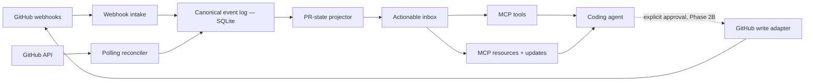

# PR Watcher MCP — Phase 2 Plan

**Status:** Draft

**Date:** 2026-07-21

**Proposed phase:** Reliable Review Inbox

**Planning assumption:** One primary engineer, six weeks, local-first deployment

## Executive decision

Phase 2 should turn the MVP from a raw event collector into a dependable, low-context **PR feedback inbox for coding agents**.

The product should not try to become another general GitHub MCP server or AI review bot. GitHub's MCP server already exposes broad repository and pull-request operations, while CodeRabbit and Greptile generate automated reviews and fixes. The defensible job for this project is different: preserve asynchronous human and bot feedback, reconcile it into current PR state, and tell an agent exactly what became actionable since its last acknowledged checkpoint.

The phase has two release gates:

1. **Phase 2A — reliable read path:** loss-resistant ingestion, transactional storage, correct acknowledgement semantics, normalized review threads, concise MCP output, diagnostics, and tests.
2. **Phase 2B — assisted-action pilot:** optional replies and thread resolution with explicit approval and audit records. This does not begin until the read path passes the reliability gate.

If capacity is limited, ship 2A and defer 2B. A trustworthy inbox is more valuable than an unreliable closed loop.

## Product thesis

### User and job

The primary user is a developer running Codex, Claude Code, or another MCP client while a pull request is under review.

Their job is:

> Keep an agent aligned with the latest PR feedback without repeatedly re-reading the entire GitHub conversation, losing comments, or allowing the agent to act on GitHub without a clear approval boundary.

### Positioning

PR Watcher should be the **asynchronous state and handoff layer** between GitHub review activity and coding agents:

- GitHub remains the system of record.
- The watcher maintains a durable, compact, agent-oriented inbox.
- Existing GitHub tools remain the way to inspect arbitrary repository data.
- Review bots are event producers the watcher can ingest, not competitors it needs to imitate.

This positioning is supported by the current market:

- The official GitHub MCP server offers configurable pull-request tools, read-only mode, and tool exclusion, so reproducing broad GitHub CRUD would add little differentiation ([GitHub MCP server configuration](https://github.com/github/github-mcp-server/blob/main/docs/server-configuration.md)).
- CodeRabbit emphasizes automatic reviews, conversational comments, incremental re-review, and one-click fixes ([CodeRabbit pull-request reviews](https://docs.coderabbit.ai/overview/pull-request-review)).
- Greptile emphasizes codebase-aware automated review and agent handoff for fixes ([Greptile overview](https://www.greptile.com/docs/introduction)).
- Industrial evidence is a warning against optimizing for comment volume: one study found useful bug detection but also faulty or irrelevant comments and longer average PR closure time ([Automated Code Review in Practice](https://arxiv.org/abs/2412.18531)).

The implication is to optimize for **correct state, signal quality, and time-to-response**, not generated-review count.

## MVP baseline and gaps

The MVP successfully demonstrates:

- A stdio MCP server with six focused tools.
- Repository webhook intake with HMAC-SHA256 verification when a secret is configured.
- REST polling fallback for issue comments, review comments, and reviews.
- Local persistence, external-ID deduplication, and per-watch cursors.
- A deliberately read-only GitHub posture.

The following issues should be treated as Phase 2 entry criteria, not optional polish.

| Priority | Finding | Consequence |
|---|---|---|
| P0 | `issue_comment` webhooks use `payload.issue.number`; the handler currently requires `payload.pull_request.number`. | Normal PR conversation comments delivered by webhook are silently ignored. |
| P0 | `get_new_pr_events` advances the watch cursor before `ack_pr_event`. | Merely reading can consume feedback, so a failed agent turn may lose work. |
| P0 | The poller records the completion time as its next `since` watermark. | Activity created between the API snapshot and watermark update can be missed. |
| P0 | The reviews endpoint does not support `since`, but the poller sends it and only reads the first 100 rows. | Old PRs or busy PRs can hide new reviews beyond page one. GitHub documents only `per_page` and `page` for this endpoint ([review API](https://docs.github.com/en/rest/pulls/reviews#list-reviews-for-a-pull-request)). |
| P0 | JSON persistence uses direct `writeFile`; initialization treats read, parse, and corruption errors as an empty store. | A crash or corrupt file can produce silent data loss. |
| P0 | There are no tests. | Signature, replay, pagination, cursor, and recovery behavior cannot be changed safely. |
| P1 | Webhook deduplication does not use `X-GitHub-Delivery`, event actions are not normalized, and deliveries may arrive out of order. | Replays and state transitions cannot be reconciled reliably. GitHub recommends delivery-ID deduplication and warns that delivery order can differ from event order ([webhook best practices](https://docs.github.com/en/webhooks/using-webhooks/best-practices-for-using-webhooks), [troubleshooting](https://docs.github.com/en/webhooks/testing-and-troubleshooting-webhooks#webhook-deliveries-are-out-of-order)). |
| P1 | PR lifecycle, edited comments, thread resolution, CI checks, and head-SHA changes are not modeled. | The agent sees raw activity but cannot answer “what remains actionable?” |
| P1 | The store grows without retention, compaction, or raw-payload policy. | Long-running usage increases context, disk, and sensitive-data exposure. |
| P1 | Watches cannot be paused or removed and health does not expose degraded subsystems. | Recovery requires editing local data or restarting blindly. |
| P2 | Tool results are JSON encoded as text and have no risk annotations or resource subscription model. | Clients receive more context and fewer behavioral hints than necessary. |

The repository builds under the current environment. Its test command cannot run there because the active runtime is Node 18.0.0, which does not support `node --test`; Phase 2 should pin and enforce a supported Node version in development and CI.

## Phase 2 outcomes

By the end of Phase 2A, a user can:

1. Watch a PR and receive issue comments, review comments, reviews, thread state changes, PR lifecycle changes, and relevant check completions.
2. Ask for a compact inbox containing only new or currently actionable items.
3. Re-read unacknowledged items safely after a client failure.
4. See unresolved review threads and the PR's current head SHA, review decision, and checks summary.
5. Understand whether webhook delivery, polling, authentication, or storage is degraded.
6. Restart the process during activity without corrupting or silently discarding state.

If the Phase 2B gate is approved, a user can also:

7. Preview and explicitly approve a reply or thread-resolution action.
8. Audit what the watcher sent, under which policy, and which GitHub object changed.

## Non-goals

Do not include these in Phase 2:

- Generating independent AI code reviews.
- Automatically editing a local checkout or pushing commits.
- Auto-merging, approving reviews, or dismissing reviews.
- A hosted multi-tenant SaaS control plane.
- A web dashboard.
- Replacing general GitHub MCP tools.
- Slack, email, Jira, or other notification integrations.
- Multi-provider support for GitLab or Bitbucket.
- Exactly-once end-to-end delivery claims. The realistic contract is idempotent ingestion plus at-least-once consumption until acknowledgement.

## Proposed architecture



### Design rules

- **Append facts, project state:** retain canonical events and derive the latest thread/check/PR view. Do not make raw webhook shape the public MCP contract.
- **Separate receipt from acknowledgement:** fetching is read-only; only acknowledgement changes the consumer checkpoint.
- **Idempotency at every boundary:** delivery GUID for webhooks, provider object ID plus revision for API objects, and a client-supplied idempotency key for writes.
- **Source time and receipt time are distinct:** source timestamps reconcile out-of-order events; monotonic local sequence supports consumption.
- **Webhook first, polling as reconciliation:** GitHub recommends webhooks instead of routine polling; polling should repair gaps and support local setups without a public endpoint ([REST API best practices](https://docs.github.com/en/rest/using-the-rest-api/best-practices-for-using-the-rest-api#avoid-polling)).
- **Concise by default, detail on demand:** summaries and normalized fields are default; raw payloads and long bodies require an explicit detail option.
- **Fail closed for writes:** no write tool is registered unless write mode and an approval policy are both configured.

## Workstreams

### 1. Canonical event and watch model — P0

Define versioned types before changing transport code.

Minimum event envelope:

```ts
type CanonicalPrEvent = {
  schemaVersion: 1;
  id: string;
  watchId: string;
  sequence: number;
  provider: "github";
  deliveryId?: string;
  sourceId: string;
  sourceRevision: string;
  event: string;
  action: string;
  kind: "conversation" | "review" | "thread" | "pr" | "check";
  sourceCreatedAt: string;
  sourceUpdatedAt: string;
  receivedAt: string;
  actor?: string;
  body?: string;
  path?: string;
  line?: number;
  url?: string;
  headSha?: string;
};
```

Required normalized actions include comment `created`, `edited`, and `deleted`; review `submitted`, `edited`, and `dismissed`; thread `resolved` and `unresolved`; PR `opened`, `synchronize`, `ready_for_review`, `closed`, and `reopened`; and check `completed`.

Keep raw payloads optional, apply a size cap, and define retention separately from canonical fields.

### 2. Transactional local persistence — P0

Replace the JSON snapshot with SQLite and migrations.

Suggested tables:

- `watches`: identity, state, filters, creation time, latest known head SHA.
- `deliveries`: GitHub delivery GUID, signature result, receipt time, processing state, error.
- `events`: canonical append log with unique provider/source/revision key.
- `consumer_offsets`: watch plus consumer ID and last acknowledged sequence.
- `pr_snapshots`: projected current state and projection version.
- `outbound_actions`: Phase 2B idempotency key, preview hash, approval, result, audit timestamps.

Use transactions for delivery receipt plus event append. Enable foreign keys and choose WAL only for a local filesystem; SQLite documents atomic commit and concurrent reads with WAL, while also warning that WAL is not suitable for a network filesystem ([SQLite WAL](https://sqlite.org/wal.html), [atomic commit](https://sqlite.org/atomiccommit.html)).

Provide a one-time JSON migration with backup, validation, and rollback instructions. Never replace an unreadable store with an empty one.

### 3. Correct webhook ingestion — P0

- Require a webhook secret outside an explicit insecure-development mode.
- Validate content type, body size, signature, event header, action, and delivery GUID.
- Persist the delivery GUID before processing to make replay idempotent.
- Return 2xx promptly and process after durable receipt; GitHub requires a response within ten seconds and recommends asynchronous processing ([webhook best practices](https://docs.github.com/en/webhooks/using-webhooks/best-practices-for-using-webhooks#respond-within-10-seconds)).
- Correctly identify issue comments on PRs using `issue.pull_request` and `issue.number`.
- Subscribe only to supported events/actions and record unsupported deliveries as ignored, not successful events.
- Add `pull_request_review_thread` to capture resolved and unresolved transitions ([GitHub event payloads](https://docs.github.com/en/webhooks/webhook-events-and-payloads#pull_request_review_thread)).
- Reconcile using payload timestamps because GitHub does not guarantee delivery order.

Automatic webhook redelivery is not required for the local MVP. Diagnostics should identify gaps and link to recovery guidance; GitHub does not automatically redeliver failures ([failed deliveries](https://docs.github.com/en/webhooks/using-webhooks/handling-failed-webhook-deliveries)).

### 4. Reliable polling reconciler — P0

- Record the poll-start watermark, not completion time, and use an overlap window.
- Use endpoint-specific cursors. Do not assume every endpoint supports `since`.
- Follow `Link` headers until exhausted, with configurable safety limits.
- Use conditional requests with ETags where useful; authenticated `304` responses do not consume the primary rate limit ([REST API best practices](https://docs.github.com/en/rest/using-the-rest-api/best-practices-for-using-the-rest-api#use-conditional-requests-if-appropriate)).
- Track rate-limit response headers and honor `Retry-After` and reset times. Apply exponential backoff and expose the next eligible poll time ([GitHub rate limits](https://docs.github.com/en/rest/using-the-rest-api/rate-limits-for-the-rest-api)).
- Return `fetched`, `inserted`, `updated`, and `deduplicated` counts instead of incrementing “added” for every fetched object.
- Reconcile review threads through GraphQL because thread resolution is part of the `PullRequestReviewThread` model, while REST review comments do not provide the complete conversation state ([GraphQL pull-request reference](https://docs.github.com/en/graphql/reference/pulls#pullrequestreviewthread)).
- Make scheduled polling optional; keep `poll_pr_now` for deterministic recovery and testing.

### 5. Agent-oriented inbox and MCP contract — P1

Replace raw-event-first usage with four primary operations:

| Tool/resource | Behavior |
|---|---|
| `watch_pr` | Idempotently create or update a watch with filters and return setup diagnostics. |
| `get_pr_inbox` | Return unacknowledged normalized items, grouped by thread and bounded by `limit`; never move an offset. |
| `ack_pr_inbox` | Acknowledge through a sequence or item set for one watch and one consumer; reject invalid cross-watch sequences. |
| `get_pr_status` | Return head SHA, lifecycle state, review decision, unresolved-thread count, checks summary, last webhook, last poll, and degraded reasons. |

Secondary operations:

- `list_watches`, `pause_watch`, `resume_watch`, and `remove_watch`.
- `reconcile_pr_now`, replacing the ambiguous polling-only name.
- `get_pr_event_detail` for a single full body or retained raw payload.
- `pr-watcher://watches/{id}/inbox` and `pr-watcher://watches/{id}/status` resources.

When the client supports resource subscriptions, emit `notifications/resources/updated`; keep bounded waiting as a compatibility fallback. MCP resources are designed to expose URI-addressed context and updates, and tool annotations can label read-only, idempotent, and open-world behavior ([MCP resources](https://modelcontextprotocol.io/specification/2025-06-18/server/resources), [MCP schema](https://modelcontextprotocol.io/specification/2025-11-25/schema#toolannotations)).

Response defaults:

- Empty inbox response under 1 KB.
- Bodies truncated to a configurable size with `detail_available: true`.
- Stable structured fields plus a short text summary.
- Pagination token or `next_after_sequence` for bursts.
- Bot/self-author filters and event-kind filters on each watch.

### 6. Current-state projection — P1

The projector should answer:

- What feedback is new?
- Which threads remain unresolved?
- Which comments were edited or deleted?
- Did the PR head change after feedback was posted?
- Are requested changes still active?
- Are required checks failing, pending, or successful?
- Is the PR closed, merged, or converted to draft?

Project thread state from GraphQL plus webhook deltas. Treat the head SHA as part of the snapshot so the agent can detect stale feedback and avoid replying as if a fix exists on a different revision.

Checks should be summary-only in Phase 2. Ingest `check_run.completed` and reconcile the latest head when requested. Do not build or publish custom check runs; GitHub reserves check-run write operations for GitHub Apps and this is outside the phase's core job ([GitHub Checks guide](https://docs.github.com/en/rest/guides/using-the-rest-api-to-interact-with-checks)).

### 7. Diagnostics and operability — P1

Add a `doctor` command or MCP tool that reports:

- Runtime and supported Node version.
- Database path, schema version, integrity check, and free disk warning.
- Webhook bind status, public-delivery recency, secret configuration, and last delivery error.
- GitHub authentication mode, repository access check, scopes/permissions where available, and rate-limit state.
- Per-watch last event, last acknowledgement, last reconciliation, and lag.

Use structured logs on stderr with secret redaction and configurable levels. Add graceful shutdown so in-flight intake and database transactions finish cleanly.

### 8. Authentication evolution — P1 discovery, P2 implementation

Keep fine-grained PAT support for the local-first release. Add an authentication interface so a GitHub App can be implemented without changing ingestion or projection.

Run a short GitHub App spike during Phase 2A and record an ADR. GitHub recommends Apps for automations because they provide fine-grained repository selection, short-lived tokens, centralized webhooks, and scalable rate limits ([GitHub App comparison](https://docs.github.com/en/apps/oauth-apps/building-oauth-apps/differences-between-github-apps-and-oauth-apps)).

Do not force an App migration in this phase: it introduces public hosting, installation lifecycle, private-key handling, and token refresh that are disproportionate for a single-user local tool. Adopt it when the product moves to a shared/team deployment or requires GitHub-side writes at scale.

### 9. Approval-gated GitHub actions — Phase 2B only

Candidate tools:

- `preview_review_reply`
- `post_review_reply`
- `preview_resolve_thread`
- `resolve_review_thread`

Controls:

- Disabled by default and absent from tool discovery unless configured.
- Explicit preview object with target repository, PR, thread/comment, exact body, actor, and expiration.
- A second call with the preview hash and a client-supplied idempotency key.
- Repository allowlist, maximum body size, and no arbitrary GraphQL or REST passthrough.
- Complete outbound audit record with redacted errors.
- Correct MCP risk annotations; annotations are hints, not a substitute for authorization.
- If client elicitation is used, never request secrets and preserve accept, decline, and cancel outcomes ([MCP elicitation security](https://modelcontextprotocol.io/specification/2025-06-18/client/elicitation#security-considerations)).

No automatic posting based solely on model output is permitted in Phase 2.

## Delivery plan

### Week 1 — contract and test harness

- Pin supported Node version and add CI for build plus tests.
- Define canonical schemas and consumption semantics.
- Create webhook fixtures for every supported event/action.
- Add characterization tests for the current MVP, including known failing cases.
- Write storage and GitHub App ADRs.

**Exit:** schemas reviewed; tests reproduce issue-comment loss, read-before-ack loss, review pagination, and poll-watermark race.

### Week 2 — transactional store

- Implement SQLite repository and migrations.
- Add delivery, event, offset, and snapshot tables.
- Implement JSON import with backup and integrity validation.
- Make fetch non-consuming and acknowledgement watch-scoped and idempotent.

**Exit:** crash/restart and migration tests pass; corrupt input never becomes an empty live store silently.

### Week 3 — ingestion correctness

- Replace webhook parsing with typed, event-specific adapters.
- Add delivery GUID deduplication, action filtering, issue-comment correction, and thread events.
- Implement prompt durable receipt acknowledgement and background processing.
- Add out-of-order and replay tests.

**Exit:** fixture suite proves every supported webhook maps to the expected canonical event exactly once.

### Week 4 — reconciliation and projection

- Implement endpoint-specific REST pagination, overlap watermarks, ETags, and rate-limit handling.
- Add GraphQL thread reconciliation.
- Project PR, review, thread, and checks summary state.
- Add deterministic GitHub API fakes; no live API is required for the normal suite.

**Exit:** a 250-comment/review fixture, edited comment, missed webhook, and head change all converge to the correct snapshot.

### Week 5 — MCP inbox and diagnostics

- Add the new tools, resources, annotations, bounded results, and filters.
- Preserve deprecated MVP tool aliases for one release with warnings.
- Add doctor/status output and structured logging.
- Update README setup, migration, recovery, and security guidance.

**Exit:** an agent can recover after restart, receive only unacknowledged actionable items, inspect detail on demand, and acknowledge safely.

### Week 6 — dogfood and release gate

- Dogfood across at least ten PRs, including one bot-reviewed PR, one busy PR, and one PR with webhook downtime.
- Run replay, crash, corruption, rate-limit, and long-running retention tests.
- Measure detection latency and response size.
- Fix reliability defects; publish `0.2.0` only if the gate below passes.
- Decide whether Phase 2B is authorized based on results.

**Exit:** Phase 2A release gate passed and migration/recovery runbook exercised from a clean machine.

Phase 2B, if approved, should be a separate two-week pilot after `0.2.0`, not a reason to delay the reliable inbox.

## Release gate and success metrics

### Reliability gate

All conditions are mandatory:

- Zero lost supported events in fixture replay, polling-gap, and crash-restart suites.
- Duplicate webhook delivery produces one canonical revision.
- Fetching without acknowledgement returns the same items after restart.
- Acknowledgement cannot skip another watch's events.
- Polling retrieves more than 100 comments/reviews and converges after an overlapping poll.
- Edited/deleted comments and resolved/unresolved threads produce correct current state.
- Database integrity check and JSON migration rollback are tested.
- No secret appears in logs or stored diagnostics.

### Product metrics

Collect locally and opt-in only; do not add remote telemetry in Phase 2.

| Metric | Target |
|---|---|
| Webhook receipt to inbox availability | p95 under 2 seconds locally |
| Poll reconciliation detection | Within one configured interval plus 30 seconds |
| Empty inbox response | Under 1 KB |
| Ten-item inbox response | Under 12 KB by default |
| Duplicate items shown to agent | 0 in release suite; under 0.1% in dogfood |
| Manual recovery during dogfood | 0 unrecoverable incidents |
| Actionable feedback acknowledged | Median time at least 30% lower than manual re-check baseline |
| False “all clear” state | 0 in dogfood sample |

Do not use event count or generated comment count as a success metric.

## Minimum test matrix

### Webhooks

- Valid and invalid HMAC; missing secret in production mode.
- Oversized, malformed, and wrong-content-type requests.
- Issue comment on PR versus ordinary issue.
- Review, review comment, edited comment, deleted comment.
- Thread resolved and unresolved.
- PR synchronize, close, reopen, draft, and ready-for-review.
- Check completion associated with current and stale head SHA.
- Duplicate GUID, redelivery, unsupported action, and out-of-order timestamps.

### Polling

- Public unauthenticated and private authenticated repository behavior.
- Pagination at 0, 1, 100, 101, and 250 items.
- Endpoint with and without `since` support.
- Same-timestamp boundary and activity during an in-flight poll.
- ETag `304`, `403`, `404`, `429`, `Retry-After`, reset, timeout, and partial endpoint failure.
- Deduplicated insert versus updated revision counts.

### Store and consumption

- New, migrated, corrupt, locked, and unwritable database.
- Crash before and after transaction commit.
- Concurrent webhook and poll of the same object.
- Read without ack, repeated ack, stale ack, future ack, and cross-watch ack.
- Pause, resume, remove, retention, and raw-payload pruning.

### MCP contract

- Stable schema snapshots and structured error codes.
- Response truncation, pagination, filters, and detail retrieval.
- Resource update with subscribing and non-subscribing clients.
- Deprecated tool compatibility for one release.
- Write tools absent unless Phase 2B configuration is valid.

## Key risks and mitigations

| Risk | Mitigation |
|---|---|
| Scope expands into a full GitHub client. | Enforce the non-goals and integrate conceptually with broad GitHub MCP tools instead of duplicating them. |
| “Exactly once” is promised but impossible across process and network boundaries. | Document idempotent ingestion and at-least-once consumption until ack; test replays. |
| Polling races continue despite timestamps. | Use poll-start watermark, overlap, object revisions, and periodic full thread reconciliation. |
| SQLite migration surprises existing users. | Back up JSON, dry-run validation, atomic cutover, documented rollback. |
| Raw review text contains secrets or prompt injection. | Minimize retained raw data, mark external content as untrusted, support author filters, and never let inbound text authorize outbound actions. |
| Approval UI varies by MCP client. | Keep two-step preview/commit enforcement server-side; treat elicitation as an optional UX improvement. |
| GitHub API or webhook schema changes. | Version adapters, reject/record unknown actions, pin an API version, and keep fixtures sourced from documented payloads. |
| GitHub App work delays the local product. | Limit Phase 2A to an auth interface and ADR; implement the App only for a validated team/shared deployment need. |

## Decisions required before implementation

The recommended defaults are shown first.

1. **Phase boundary:** ship reliable read path first; treat GitHub writes as a separately approved Phase 2B pilot.
2. **Deployment:** remain local-first for `0.2.0`; do not introduce hosted infrastructure.
3. **Storage:** adopt SQLite with a documented local-filesystem requirement and transactional JSON migration.
4. **Compatibility:** keep old tool names as deprecated aliases for one minor release.
5. **Runtime:** require a current supported Node LTS release and enforce it with `engines`, `.nvmrc` or equivalent, and CI.
6. **Telemetry:** local metrics and logs only; no remote collection.
7. **Raw payload retention:** off by default after successful normalization, or capped to a short configurable diagnostic window.

## Recommended first implementation slice

The first pull request should be intentionally narrow:

1. Add a supported Node version policy and CI.
2. Add webhook fixtures and tests for HMAC, issue comments, delivery replay, and event/action parsing.
3. Introduce canonical event types without changing storage yet.
4. Fix issue-comment extraction and stop reads from advancing the cursor.

This slice immediately removes two loss modes, establishes the contract, and makes the SQLite migration safer to review in the next pull request.

## Research notes

Primary references used for this plan:

- [GitHub webhook best practices](https://docs.github.com/en/webhooks/using-webhooks/best-practices-for-using-webhooks)
- [GitHub webhook troubleshooting](https://docs.github.com/en/webhooks/testing-and-troubleshooting-webhooks)
- [GitHub webhook events and payloads](https://docs.github.com/en/webhooks/webhook-events-and-payloads)
- [GitHub REST API best practices](https://docs.github.com/en/rest/using-the-rest-api/best-practices-for-using-the-rest-api)
- [GitHub REST API rate limits](https://docs.github.com/en/rest/using-the-rest-api/rate-limits-for-the-rest-api)
- [GitHub pull-request review comments](https://docs.github.com/en/rest/pulls/comments)
- [GitHub pull-request reviews](https://docs.github.com/en/rest/pulls/reviews)
- [GitHub App versus OAuth app](https://docs.github.com/en/apps/oauth-apps/building-oauth-apps/differences-between-github-apps-and-oauth-apps)
- [GitHub MCP server configuration](https://github.com/github/github-mcp-server/blob/main/docs/server-configuration.md)
- [MCP resources](https://modelcontextprotocol.io/specification/2025-06-18/server/resources)
- [MCP elicitation](https://modelcontextprotocol.io/specification/2025-06-18/client/elicitation)
- [MCP schema and tool annotations](https://modelcontextprotocol.io/specification/2025-11-25/schema)
- [SQLite write-ahead logging](https://sqlite.org/wal.html)
- [SQLite atomic commit](https://sqlite.org/atomiccommit.html)
- [Automated Code Review in Practice](https://arxiv.org/abs/2412.18531)
